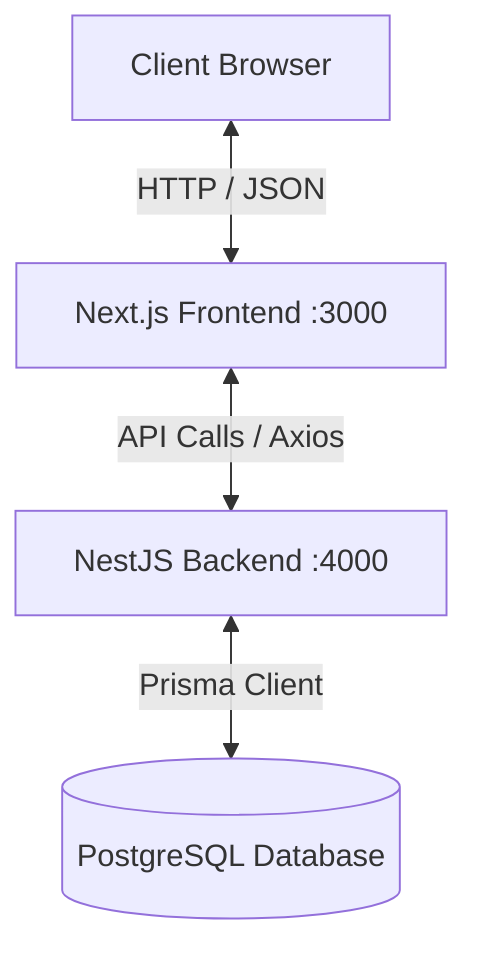

# 🌌 Project Ankihoi

Welcome to **Project Ankihoi**, a cutting-edge full-stack monorepo web application designed with a high-performance **Next.js frontend** and a robust, modular **NestJS backend**. 

This repository is organized to ensure optimal separation of concerns, fast local development, seamless database integrations using Prisma, and high-fidelity, modern user experiences.

---

## 🏗️ System Architecture

The project is structured as a multi-service monorepo:



---

## 📁 Repository Directory Structure

```filepath
App/
├── backend/                # NestJS API application
│   ├── src/                # Backend application logic
│   │   ├── app.controller  # Standard routes and entry points
│   │   ├── app.module      # Root NestJS Module
│   │   └── main.ts         # Server bootstrap entry file
│   ├── prisma/             # Prisma database schema and migrations
│   └── package.json        # Backend configuration and dependencies
├── frontend/               # Next.js App Router application
│   ├── src/                # Frontend source code
│   │   └── app/            # Next.js App Router (Layouts & Pages)
│   ├── public/             # Static assets (images, icons)
│   └── package.json        # Frontend configuration and dependencies
└── README.md               # Master root documentation (This file)
```

---

## 🛠️ Technology Stack & Libraries

### 💻 Frontend (Next.js App Router)
- **Framework**: [Next.js 16](https://nextjs.org/) (App Router) & [React 19](https://react.dev/)
- **State Management**: [Zustand](https://github.com/pmndrs/zustand) (Sleek, lightweight, and reactive client state)
- **Data Fetching**: [TanStack React Query v5](https://tanstack.com/query/latest) (Robust caching, background updates, and state syncing)
- **HTTP Client**: [Axios](https://axios-http.com/)
- **Language**: TypeScript

### ⚙️ Backend (NestJS Server)
- **Framework**: [NestJS 11](https://nestjs.com/) (Modular Architecture)
- **ORM**: [Prisma ORM](https://www.prisma.io/) (Typesafe Database access to PostgreSQL)
- **Language**: TypeScript

---

## 🚀 Getting Started & Local Setup

### Prerequisites
Ensure you have the following installed on your machine:
- [Node.js](https://nodejs.org/) (v18+ recommended)
- [npm](https://www.npmjs.com/) or `pnpm`
- A running [PostgreSQL](https://www.postgresql.org/) database instance

---

### 1. Database & Backend Configuration

1. **Navigate to the backend directory:**
   ```bash
   cd backend
   ```

2. **Configure Environment Variables:**
   Create a `.env` file in the `backend/` directory and configure your PostgreSQL database connection:
   ```env
   DATABASE_URL="postgresql://<username>:<password>@localhost:5432/<database_name>?schema=public"
   PORT=4000
   ```

3. **Install Backend Dependencies:**
   ```bash
   npm install
   ```

4. **Synchronize Prisma Database Schema:**
   Generate the Prisma Client and sync migrations:
   ```bash
   npx prisma generate
   npx prisma db push
   ```

5. **Start the Backend Server in Watch Mode:**
   ```bash
   npm run start:dev
   ```
   The backend server runs locally at: `http://localhost:4000`

---

### 2. Frontend Configuration & Execution

1. **Navigate to the frontend directory:**
   ```bash
   cd ../frontend
   ```

2. **Install Frontend Dependencies:**
   ```bash
   npm install
   ```

3. **Start the Next.js Development Server:**
   ```bash
   npm run dev
   ```
   The frontend application is accessible at: `http://localhost:3000`

---

## 🧹 Code Quality & Formatting

To ensure consistent code quality across the workspace:
* **ESLint**: Configured to analyze TypeScript files. Run lint checking with:
  ```bash
  npm run lint
  ```
* **Prettier**: Code formatting rules are strictly enforced. Auto-format with:
  ```bash
  npm run format
  ```
